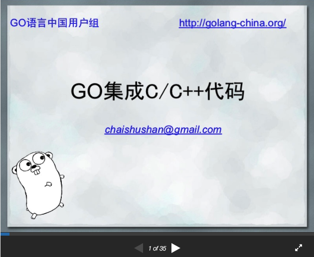
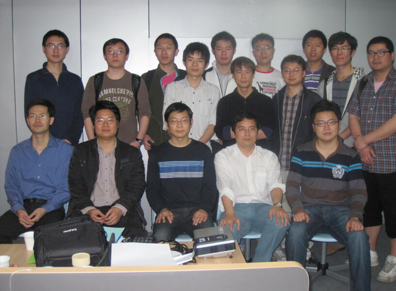

<!--
// Copyright 2018 ChaiShushan <chaishushan{AT}gmail.com>. All rights reserved.
// Use of this source code is governed by a BSD-style
// license that can be found in the LICENSE file.
-->

<!-- ++++++++++++++++++++++++++++++++++++++++++++++++++++++++++++++++++++++  -->

<!-- *** 横向分隔, --- 竖向分隔, Note: 讲稿注释  -->

<!--
Reveal.js 可能会需要 AJAX 异步加载 Markdown 文件, 可以在当前目录启动一个 http 服务.

以下是常见的临时启动 http 服务器的方式:

	NodeJS
	npm install http-server -g
	http-server

	Python2
	python -m SimpleHTTPServer

	Python3
	python -m http.server

	Golang
	go run server.go

启动后, 本地可以访问 http://127.0.0.1:port, 其中 port 为端口号, 命令行有提示.

幻灯片操作: F键全屏, S键显示注解, ESC大纲模式, ESC退出全屏或大纲模式, ?显示帮助

-->

<!-- ++++++++++++++++++++++++++++++++++++++++++++++++++++++++++++++++++++++  -->

<section data-background="images/gopherchina2018-background.jpg">

# 深入CGO编程 <!-- .element: style="color:DarkSlateGray;" -->
------------

#### [chai2010 (柴树杉)](https://chai2010.cn) <!-- .element: style="color:DarkSlateGray;" -->
#### [@青云QingCloud](https://www.qingcloud.com/) <!-- .element: style="color:DarkSlateGray;" -->


<!-- ++++++++++++++++++++++++++++++++++++++++++++++++++++++++++++++++++++++  -->
***

## 感谢 GopherChina
------------------

####  <!-- .element: style="width:75%;" -->
#### http://gopherchina.org/

---
### 感谢 韦光京 对CGO的贡献
------------------------

####  <!-- .element: style="width:60%;" -->

#### https://github.com/golang/go/commits?author=wgj-zz

---
### 幻灯片 网址
-------------

####  <!-- .element: style="width:40%;" -->

#### https://github.com/chai2010/gopherchina2018-cgo-talk

<!-- ++++++++++++++++++++++++++++++++++++++++++++++++++++++++++++++++++++++  -->
***

## 个人简介
----------

- [@青云QingCloud](http://qingcloud.com/), 应用平台研发工程师
- [Go语言代码](https://golang.org/CONTRIBUTORS) 贡献者(ChaiShushan)
- [Go语言圣经](https://github.com/golang-china/gopl-zh) 翻译者
- [Go语言高级编程](https://github.com/chai2010/advanced-go-programming-book) 作者(开发中...)
- [OpenPitrix](https://github.com/openpitrix/openpitrix) 多云应用管理平台开发者
- https://github.com/chai2010
- https://chai2010.cn


---
### 珠三角技术沙龙深圳(2011.02.27)
-------------------------------

####  <!-- .element: width="60%" -->

#### [Go集成C&C++代码](https://www.slideshare.net/yashi88/gocc)

<!--
#### [Go语言简介](https://www.slideshare.net/yashi88/go-7148661
) - 韦光京
#### [Go语言Web开发](https://www.slideshare.net/yashi88/goweb-7506006
) - 韦光京
-->

---
### 珠三角技术沙龙深圳(2011.02.27)
-------------------------------

####  <!-- .element: width="65%" -->

#### [更多图片](https://www.flickr.com/photos/yashi88/sets/72157626155161952/with/5482309510/)

---
### 个人签名
----------

- 当歌曲、传说都已经缄默的时候，只有代码还在说话!
- Less is more!


<!-- ++++++++++++++++++++++++++++++++++++++++++++++++++++++++++++++++++++++  -->
***

## 内容大纲
----------

- CGO的价值

--------

- 快速入门
- 类型转换
- 函数调用
- CGO内部机制
- 实战: 包装 `C.qsort`
- 内存模型

--------

---
### 内容大纲(续)
--------------

- Go访问C++对象, Go对象导出为C++对象
- 静态库和动态库
- 编写Python扩展
- 编译和链接参数

----------

<!-- ++++++++++++++++++++++++++++++++++++++++++++++++++++++++++++++++++++++  -->
***

## CGO的价值
--------------

- 小调查: 有多少人 **听说过** 或 **简单使用过** CGO?

--------

1. 没有银弹, Go语言也不是银弹, 无法解决全部问题
2. 通过CGO可以继承C/C++将近半个世纪的软件积累
3. 通过CGO可以用Go给其它系统写C接口的共享库
4. CGO是Go和其它语言直接通讯的桥梁

--------

- CGO 是一个保底的后备技术
- CGO 是 Go 的替补技术

---

### 可能的CGO的场景
----------------

- 通过OpenGL或OpenCL使用显卡的计算能力
- 通过OpenCV来进行图像分析
- 通过Go编写Python扩展
- 通过Go编写移动应用

---
### Cgo is not Go
-----------------

##### https://dave.cheney.net/2016/01/18/cgo-is-not-go


<!-- ++++++++++++++++++++++++++++++++++++++++++++++++++++++++++++++++++++++  -->
***


## 快速入门
---------

```go
import "C"

func main() {
	println("hello cgo")
}
```

-----

- `import "C"` 表示启用 CGO
- 最简单的CGO程序

---
## 快速入门
---------

examples/hello-v1/main.go:

```go
package main

//#include <stdio.h>
import "C"

func main() {
	C.puts(C.CString("你好, GopherChina 2018!\n"))
}
```

-----

编译运行:

```
$ go run examples/hello-v1/main.go
你好, GopherChina 2018!
```

---

### 简单说明
----------

- `import "C"` 表示启用 CGO
- `import "C"` 前的注释表示包含C头文件: `<stdio.h>`
- `C.CString` 表示将 Go 字符串转为 C 字符串
- `C.puts` 调用C语言的puts函数输出 C 字符串

Note: 小问题: C 字符串什么时候释放?

---
### 调用自定义的C函数
-----------------

examples/hello-v2/main.go:

```go
package main

/*
#include <stdio.h>

static void SayHello(const char* s) {
	puts(s);
}
*/
import "C"

func main() {
	C.SayHello(C.CString("Hello, World\n"))
}
```

------------

---
### C代码模块化
------------

examples/hello-v3/hello.h:

```c
extern void SayHello(const char* s);
```

examples/hello-v3/hello.c:

```c
#include "hello.h"

#include <stdio.h>

void SayHello(const char* s) {
	puts(s);
}
```

examples/hello-v3/main.go:

```go
//#include "./hello.h"
import "C"
```

----------

---
### C代码模块化 - 改用Go重写C模块
----------------------------

examples/hello-v4/hello.h:

```c
extern void SayHello(/* const */ char* s);
```

examples/hello-v4/hello.go:

```go
package main

import "C"
import "fmt"

//export SayHello
func SayHello(s *C.char) {
	fmt.Print(C.GoString(s))
}
```

------

- 函数参数去掉 `const` 修饰符
- hello.c => hello.go

---
### 手中无剑, 心中有剑
-------------------

examples/hello-v5/hello.go:

```go
package main

// extern void SayHello(char* s);
import "C"
import "fmt"

func main() {
	C.SayHello(C.CString("Hello, World\n"))
}

//export SayHello
func SayHello(s *C.char) {
	fmt.Print(C.GoString(s))
}
```

------

- C 语言版本 SayHello 函数实现只存在于心中
- 面向纯 C 接口的 Go 语言编程


---
### 忘掉心中之剑
--------------

```go
// +build go1.10

package main

// extern void SayHello(_GoString_ s);
import "C"
import "fmt"

func main() {
	C.SayHello("Hello, World\n")
}

//export SayHello
func SayHello(s string) {
	fmt.Print(s)
}
```

----------

- GoString 也是一种 C 字符串
- Go的一切都可以从C理解


Note:
为何要引入 `C._GoString_` 类型?
为何不使用 `C.GoString` 类型?


---


### 思考题: SayHello还在主Goroutine吗
---------

```go
func main() {
	C.SayHello("Hello, World\n")
}

//export SayHello
func SayHello(s string) {
	fmt.Print(s)
}
```

---------

- 具体分析请参考稍后的 **内存模型** 一节

<!-- ++++++++++++++++++++++++++++++++++++++++++++++++++++++++++++++++++++++  -->
***

## 类型转换
----------

- 指针 - unsafe 包的灵魂
- Go字符串和切片的结构

--------

- Go指针和C指针之间的转换
- 数值和指针之间的转换
- 不同类型指针转换
- 字符串和切片转换
- ...


---
### 指针 - unsafe 包的灵魂
---------------------------

Go版无类型指针和数值化的指针:

```go
var p unsafe.Pointer = nil        // unsafe
var q uintptr        = uintptr(p) // builtin
```

C版无类型指针和数值化的指针:

```c
void     *p = NULL;
uintptr_t q = (uintptr_t)(p); // <stdint.h>
```

-----------

- `unsafe.Pointer` 是 Go指针 和 C指针 转换的中介
- `uintptr` 是 Go 中 数值 和 指针 转换的中介

---
### unsafe 包
------------

```go
type ArbitraryType int
type Pointer *ArbitraryType

func Sizeof(x ArbitraryType) uintptr
func Alignof(x ArbitraryType) uintptr

func Offsetof(x ArbitraryType) uintptr
```

-------

- Pointer: 面向编译器无法保证安全的指针类型转换
- Sizeof: 值所对应变量在内存中的大小
- Alignof: 值所对应变量在内存中地址几个字节对齐
- Offsetof: 结构体中成员的偏移量

---
### unsafe 包 - C语言版本
----------------------

```c
typedef void* Pointer;

sizeof(type or expression); // C
offsetof(type, member);     // <stddef.h>
alignof(type-id);           // C++ 11
```

-------

- C指针的安全性永远需要自己负责
- sizeof 是关键字, 语义和 Go 基本一致
- offsetof 是宏, 展开为表达式, 语义和 Go 基本一致
- alignof 是新特性, 可忽略

---
### Go字符串和切片的结构
--------------------

```go
type reflect.StringHeader struct {
	Data uintptr
	Len  int
}
type reflect.SliceHeader struct {
	Data uintptr
	Len  int
	Cap  int
}
```

```c
typedef struct { const char *p; GoInt n; } GoString;
typedef struct { void *data; GoInt len; GoInt cap; } GoSlice;
```

-------

- reflect 包定义的结构和CGO生成的C结构是一致的
- GoString 和 GoSlice 和头部结构是兼容的


---
### 实战: `int32` 和 `*C.char` 相互转换(A)
------------------------------------

####  <!-- .element: style="width:75%;" -->


---
### 实战: `int32` 和 `*C.char` 相互转换(B)
------------------------------------

```go
// int32 => *C.char
var x = int32(9527)
var p *C.char = (*C.char)(unsafe.Pointer(uintptr(x)))

// *C.char => int32
var y *C.char
var q int32 = int32(uintptr(unsafe.Pointer(y)))
```
-----

1. 第一步: `int32` => `uintprt`
1. 第二步: `uintptr` => `unsafe.Pointer`
1. 第三步: `unsafe.Pointer` => `*C.char`
1. 反之亦然


---
### 实战: `*X` 和 `*Y` 相互转换(A)
----------------------------

####  <!-- .element: style="width:60%;" -->


---
### 实战: `*X` 和 `*Y` 相互转换(B)
----------------------------

```go
var p *X
var q *Y

q = (*Y)(unsafe.Pointer(p)) // *X => *Y
p = (*X)(unsafe.Pointer(q)) // *Y => *X
```
-----

1. 第一步: `*X` => `unsafe.Pointer`
1. 第二步: `unsafe.Pointer` => `*Y`
1. 反之亦然

---
### 实战: `[]X` 和 `[]Y` 相互转换(A)
------------------------------------

####  <!-- .element: style="width:60%;" -->

---
### 实战: `[]X` 和 `[]Y` 相互转换(B)
------------------------------------

```go
var p []X
var q []Y // q = p

pHdr := (*reflect.SliceHeader)(unsafe.Pointer(&p))
qHdr := (*reflect.SliceHeader)(unsafe.Pointer(&q))

pHdr.Data = qHdr.Data
pHdr.Len = qHdr.Len * unsafe.Sizeof(q[0]) / unsafe.Sizeof(p[0])
pHdr.Cap = qHdr.Cap * unsafe.Sizeof(q[0]) / unsafe.Sizeof(p[0])
```

------

- 所有切片拥有相同的头部 `reflect.SliceHeader`
- 重新构造切片头部即可完成转换

---
### 示例: float64 数组排序优化
--------------------------

```go
func main() {
	// []float64 强制类型转换为 []int
	var a = []float64{4, 2, 5, 7, 2, 1, 88, 1}
	var b []int = ((*[1 << 20]int)(unsafe.Pointer(&a[0])))[:len(a):cap(a)]

	// 以int方式给float64排序
	sort.Ints(b)
}
```

-----

- float64遵循IEEE754浮点数标准特性
- 当浮点数有序时对应的整数也必然是有序的


<!-- ++++++++++++++++++++++++++++++++++++++++++++++++++++++++++++++++++++++  -->
***

## 函数调用
----------

- Go调用C函数
- C调用Go导出函数
- 深度调用: Go => C => Go => C

---
### Go调用C函数(A)
----------------

```go
/*
static int add(int a, int b) {
	return a+b;
}
*/
import "C"

func main() {
	C.add(1, 1)
}
```
----------------

- `C.add` 通过的 C 虚拟包访问
- 最终会转为 `_Cfunc_add` 名字


---
### Go调用C函数(B)
----------------

```go
/*
static int add(int a, int b) {
	return a+b;
}
*/
import "C"
import "fmt"

func main() {
	v, err := C.add(1, 1)
	fmt.Println(v, err)

	// Output:
	// 4 <nil>
}
```
----------------

- 任何C函数都可以带2个返回值
- 第二个返回值是 `errno`, 对应 `error` 接口类型

---
### Go调用C函数(C)
----------------

```go
/*
#include <errno.h>

static void seterrno(int v) {
	errno = v;
}
*/
import "C"
import "fmt"

func main() {
	_, err := C.seterrno(9527)
	fmt.Println(err)

	// Output:
	// errno 9527
}
```
----------------

- 即使没有返回值, 依然可以通过第二个返回值获取 errno
- 对应 void 类型函数, 第一个返回值可以用 `_` 占位


---
### Go调用C函数(D)
----------------

```go
// static void noreturn() {}
import "C"
import "fmt"

func main() {
	x, _ := C.noreturn()
	fmt.Printf("%#v\n", x)

	// Output:
	// main._Ctype_void{}
}
```
----------------

- 甚至可以获取一个 void 类型函数的返回值
- 返回值类型: `type _Ctype_void [0]byte`

<!-- 不同包都cgo类型是不通用的, 因为是私有类型 -->

---
### 导出Go函数(A)
---------------

main.go:

```go
import "C"

//export GoAdd
func GoAdd(a, b C.int) C.int {
	return a+b
}
```
-------------

- 可以导出私有函数
- 导出C函数名没有名字空间约束, 需保证全局没有重名
- main 包的导出函数会在 `_cgo_export.h` 声明

---
### 导出Go函数(B)
---------------

add.h:

```h
int c_add(int a, int b);
```

add.c:

```c
#include "add.h"
#include "_cgo_export.h"

int c_add(int a, int b) {
	return GoAdd(a, b)
}
```

---------------

- 在C文件中使用 `_cgo_export.h` 头文件
- C文件必须在同一个包, 否则会找不到头文件

---
### 导出Go函数(C)
---------------

main.go:

```go
//export int GoAdd(int a, int b);
//#include "add.h"
import "C"

func main() {
	C.GoAdd(1, 1)
	C.c_add(2, 2)
}
```
---------------

- 无法在Go文件引用导出头文件, 因为还未生成
- GoAdd 是Go导出函数, 无法通过  `_cgo_export.h` 引用
- c_add 是C定义函数, 可以通过 `add.h` 头文件引用
- 可手写函数声明, 不会形成循环依赖

---
### 导出Go函数(D)
---------------

```go
// extern void SayHello(GoString s); // GoString 在哪定义?
import "C"

//export SayHello
func SayHello(s string) {
	fmt.Print(s)
}
```
---------------

- 导出函数的参数是Go字符串
- C类型为 `GoString`, 在 `_cgo_export.h` 文件定义
- 要使用 `GoString` 类型就要引用  `_cgo_export.h` 文件
- 这时候该如何手写 SayHello 函数的声明?

---
### 导出Go函数(E)
---------------

```go
// +build go1.10

// extern void SayHello(_GoString_ s);
import "C"

//export SayHello
func SayHello(s string) {
	fmt.Print(s)
}
```
---------------

- Go 1.10 增加了 `_GoString_` 类型
- `_GoString_` 是预定义的类型, 和 `GoString` 等价
- 避免手写函数声明时出现循环依赖


---
### 深度调用: Go => C => Go => C (A)
-------------------------------

```go
/*
static int c_add(int a, int b) {
	return a+b;
}

static int go_add_proxy(int a, int b) {
	extern int GoAdd(int a, int b);
	return GoAdd(a, b);
}
*/
import "C"
```
----------------

- `go_add_proxy` 调用Go导出的 `GoAdd`


---
### 深度调用: Go => C => Go => C (B)
-------------------------------

```go
func main() {
	C.c_add(1, 1)
}

//export GoAdd
func GoAdd(a, b C.int) C.int {
	return a + b
}
```
----------------

- Go:`main` => C:`go_add_proxy` => Go:`GoAdd`


<!-- ++++++++++++++++++++++++++++++++++++++++++++++++++++++++++++++++++++++  -->
***
## CGO内部机制
-------------

- CGO生成的中间文件
- 内部调用流程: Go -> C
- 内部调用流程: C -> Go


---
### CGO生成的中间文件
-------------------

####  <!-- .element: width="95%" -->


---
### 内部调用流程: Go -> C
-------------

```go
package main

//int sum(int a, int b) { return a+b; }
import "C"

func main() {
	C.sum(1, 2)
}
```
---------------

1. `C.sum` => `_Cfunc_sum`
1. `runtime.cgocall`
1. newthread: `sum`


---
### 内部调用流程: Go -> C
-------------

####  <!-- .element: width="95%" -->

---
### 内部调用流程: C -> Go
----------------

sum.go

```go
//int sum(int a, int b);
import "C"

//export sum
func sum(a, b C.int) C.int {
	return a + b
}
```

main.c:

```c
int main() {
	extern int sum(int a, int b);
	sum(1, 2);
	return 0;
}
```
---------------

---
### 内部调用流程: C -> Go
----------------

1. c thread: `sum`
1. `ctx = cgo_runtime_init_done()`
1. `runtime/cgo/crosscall2`
1. goroutine: `_cgoexp_xxx_sum`
1. goroutine: `_cgowrap_xxx_sim`
1. goroutine: `sum`
1. `cgo_release_context(ctx)`


---
### 内部调用流程: C -> Go
----------------

####  <!-- .element: width="95%" -->


---
### C.xxx 类型不能跨越多个包
--------------------------

- 因为 `C.xxx` 最终对应 `_Ctype_xxx` 内部类型
- 因此不同包之间的 `C.int` 并不是相同的类型

<!-- ++++++++++++++++++++++++++++++++++++++++++++++++++++++++++++++++++++++  -->
***

## 实战: 包装 `C.qsort`
---------------------

```c
#include <stdlib.h>

void qsort(
	void* base, size_t num, size_t size,
	int (*compare)(const void* a, const void* b)
);
```

---------------------

- `qsort` 为 C 语言高阶函数
- 通过传入自定义的比较函数进行快排序
- 尝试包装为Go版本的qsort
- 目标: 简单易用, 功能灵活


---
### qsort 包装的分阶段目标
-----------------------

- 第一步: 用于Go固定类型数组的排序
- 第二步: 在Go中自传入比较函数
- 第三步: Go比较函数类型的简化
- 第四步: 适配更多数组类型

---
### C中的qsort
-------------

```c
#include <stdlib.h>

#define DIM(x) (sizeof(x)/sizeof((x)[0]))

static int compare(const void* a, const void* b) {
	return ( *(int*)a - *(int*)b );
}

int main() {
	int values[] = { 42, 9, 101, 95, 27, 25 };
	qsort(values, DIM(values), sizeof(values[0]), compare);
	return 0;
}
```
-------------

- DIM 宏编译时计算数组元素个数
- compare 是静态函数, 用于 qsort 的比较函数
- qsort 可用于结构体数组排序, 需要指定数组元素大小

---
### Go中的qsort(A)
-----------------

```go
/*
#include <stdlib.h>

#define DIM(x) (sizeof(x)/sizeof((x)[0]))

static int compare(const void* a, const void* b) {
	return ( *(int*)a - *(int*)b );
}

static void qsort_proxy(int values[], size_t len, size_t elemsize) {
	qsort(values, DIM(values), sizeof(values[0]), compare);
}
*/
import "C"
```
-----------------

- qsort_proxy 为代理函数
- 不能改变比较函数

---
### Go中的qsort(B)
-----------------

```go
import "unsafe"
import "fmt"

func main() {
	values := []int32{ 42, 9, 101, 95, 27, 25 };
	C.qsort_proxy(
		unsafe.Pointer(&values[0]),
		C.size_t(len(values)),
		C.size_t(unsafe.Sizeof(values[0])),
	)
	fmt.Println(values)
}
```
-----------------

- 可用于排序Go数组
- 不能改变比较函数


---
### C比较函数回调Go导出函数
-----------------------

```go
/*
extern int go_qsort_compare(void* a, void* b);

static int compare(const void* a, const void* b) {
	return go_qsort_compare((void*)(a), (void*)(b))
}
*/
import "C"

//export go_qsort_compare
func go_qsort_compare(a, b unsafe.Pointer) C.int {
	pa := (*C.int)(a)
	pb := (*C.int)(b)
	return C.int(*pa - *pb)
}
```
-----------------------

- 为何不直接传入 go_qsort_compare ?

---
### 直接使用Go导出的比较函数
------------------------

```go
/*
#include <stdlib.h>

typedef int (*qsort_cmp_func_t)(const void* a, const void* b);
extern int go_qsort_compare(void* a, void* b);
*/
import "C"

func main() {
	values := []int32{42, 9, 101, 95, 27, 25}

	C.qsort(unsafe.Pointer(&values[0]),
		C.size_t(len(values)), C.size_t(unsafe.Sizeof(values[0])),
		(C.qsort_cmp_func_t)(unsafe.Pointer(C.go_qsort_compare)),
	)
}
```
------------------------

- Go导出函数参数没有 const 修饰, 和 qosrt 不兼容
- 通过 `C.qsort_cmp_func_t` 强制转型回调函数类型

---
### 传入闭包比较函数(A)
--------------------

```go
import "C"

//export go_qsort_compare
func go_qsort_compare(a, b unsafe.Pointer) C.int {
	return go_qsort_compare_info.fn(a, b)
}

var go_qsort_compare_info struct {
	fn func(a, b unsafe.Pointer) C.int
	sync.RWMutex
}
```
--------------------

- `go_qsort_compare_info` 保存闭包比较函数信息
- 为了并发安全, 需要加锁保护

---
### 传入闭包比较函数(B)
--------------------

```go
func main() {
	values := []int32{42, 9, 101, 95, 27, 25}

	go_qsort_compare_info.Lock()
	defer go_qsort_compare_info.Unlock()
	go_qsort_compare_info.fn = func(a, b unsafe.Pointer) C.int {
		pa := (*C.int)(a)
		pb := (*C.int)(b)
		return C.int(*pa - *pb)
	}

	C.qsort(unsafe.Pointer(&values[0]),
		C.size_t(len(values)), C.size_t(unsafe.Sizeof(values[0])),
		(C.qsort_cmp_func_t)(unsafe.Pointer(C.go_qsort_compare)),
	)
}
```
--------------------

- 为了并发安全, 需要加锁保护

---
### 传入闭包比较函数(C)
--------------------

```go
func qsort(values []int32, fn func(a, b unsafe.Pointer) C.int) {
	go_qsort_compare_info.Lock()
	defer go_qsort_compare_info.Unlock()

	go_qsort_compare_info.fn = fn

	C.qsort(
		unsafe.Pointer(&values[0]),
		C.size_t(len(values)),
		C.size_t(unsafe.Sizeof(values[0])),
		(C.qsort_cmp_func_t)(unsafe.Pointer(C.go_qsort_compare)),
	)
}
```
--------------------

- 包装了Go版本的qsort函数, 支持传入闭包比较函数
- 不足: 只支持  `[]int32` 类型数组
- 不足: 比较函数依然难用


---
### 通过接口适配更多数组类型
------------------------

```go
func qsort(slice interface{}, fn func(a, b unsafe.Pointer) C.int) {
	sv := reflect.ValueOf(slice)
	if sv.Kind() != reflect.Slice {
		panic("not slice type")
	}

	go_qsort_compare_info.Lock()
	defer go_qsort_compare_info.Unlock()
	go_qsort_compare_info.fn = fn

	C.qsort(
		unsafe.Pointer(unsafe.Pointer(sv.Index(0).Addr().Pointer())),
		C.size_t(sv.Len()), C.size_t(sv.Type().Elem().Size()),
		(C.qsort_cmp_func_t)(unsafe.Pointer(C.go_qsort_compare)),
	)
}
```
------------------------

- 改用空接口接收不同数组类型(没有范型的恶果)
- 通过 reflect 来获取数组或切片的信息

---
### 简化比较函数类型(A)
--------------------

```go
func qsort(slice interface{}, fn func(a, b int) int) {
	...
}
```
-----------------

- 参考sort包的less函数: `func(i, j int) int`
- 将元素指针转为数组下标, 配合闭包函数更简单
- 返回值转为普通 int 类型

---
### 简化比较函数类型(B)
--------------------

- 如何将比较函数的指针转为数组下标?
- 通过元素指针减去数组开始地址似乎可以

-----------------

- Go中数组的内存地址可能会移动, 如何处理?
- 在`C.qsort`函数调用时, 此时Go内存已经锁定

-----------------

- 如果已经调用`C.qsort`函数, 如何告诉比较函数地址?
- 可做一个qosrt代理函数, 在入口保存数组地址

-----------------

- 以上方案似乎可行

---
### 简化比较函数类型(C)
--------------------

```go
/*
#include <stdlib.h>

extern int  go_qsort_compare(void* a, void* b);
extern void go_qsort_compare_save_base(void* base);

static void qsort_proxy(
	void* base, size_t num, size_t size,
	int (*compar)(const void* a, const void* b)
) {
	go_qsort_compare_save_base(base); // 保存数组地址
	qsort(base, num, size, compar);
}
*/
import "C"
```

--------------------

- `go_qsort_compare_save_base` 是 Go 导出函数
- 用于保存当前排序数组的地址
- 为何不在Go中直接保存?

---
### 简化比较函数类型(D)
--------------------

```go
//export go_qsort_compare_save_base
func go_qsort_compare_save_base(base unsafe.Pointer) {
	go_qsort_compare_info.base = uintptr(base)
}

var go_qsort_compare_info struct {
	base     uintptr
	elemsize uintptr
	fn       func(a, b int) int
	sync.RWMutex
}
```

--------------------

- `go_qsort_compare_info` 还增加了 elemsize 信息
- elemsize 对应数组元素的大小

---
### 简化比较函数类型(E)
--------------------

```go
//export go_qsort_compare
func go_qsort_compare(a, b unsafe.Pointer) C.int {
	var (
		// array memory is locked
		base     = go_qsort_compare_info.base
		elemsize = go_qsort_compare_info.elemsize
	)

	i := int((uintptr(a) - base) / elemsize)
	j := int((uintptr(b) - base) / elemsize)

	return C.int(go_qsort_compare_info.fn(i, j))
}
```

--------------------

- 比较函数将指针转为数组的下标
- 然后调用闭包比较函数

---
### qsort最终版本
----------------

```go
func main() {
	values := []int64{42, 9, 101, 95, 27, 25}

	qsort(values, func(i, j int) int {
		return int(values[i] - values[j])
	})
}

func qsort(slice interface{}, fn func(a, b int) int) {
	...
}
```
----------------

- 闭包的缺点: 需要借助全局变量转为C函数指针
- qsort 对全局资源产生依赖, 对并发有影响


---

####  <!-- .element: width="85%" -->


<!-- ++++++++++++++++++++++++++++++++++++++++++++++++++++++++++++++++++++++  -->
***

## 内存模型
----------

- 内存是如何对齐
- 内存是如何布局的(堆/栈)
- GC/动态栈有何影响
- 顺序一致性内存模型
- CGO指针的使用原则
- 逃逸分析是银弹吗
- 思考题: SayHello还在主Goroutine吗

------

- 理论武装代码...

---
### 结构体对齐(A)
---------------

- CPU对基础类型有对齐要求, 比如int32要求4字节对齐

-----------
- 推论1: 数组中的每个元素也要对齐
- 推论2: 结构体中的每个成员也要对齐
- 推论3: 结构体数组中每个元素的每个成员都要对齐


---
### 结构体对齐(B)
---------------

####  <!-- .element: style="width:70%;" -->
-----------

- 目前内存的顺序和定义的顺序是一致的
- 为了对齐, 出现了一些占位用的垃圾空间
- 安排适当的定义顺序可能会减少内存缝隙(阅读不友好)
- 在未来, Go或许默认会自动调整内存布局顺序

<!-- 重绘图片 -->


---
### 内存是如何布局的(堆/栈)(A)
--------------------------

- Go中有堆也有栈
- 但是不知道它们在哪里
- 不仅仅如此, 栈还会到处乱窜...

--------------

- 推论1: 无法知道变量是在栈上还是在堆上
- 推论2: 任何变量都可能在内存到处乱窜

--------------

- 以上对Go语言码农是透明的
- 但 cgo 不是 Go


---
### 内存是如何布局的(堆/栈)(B)
--------------------------

```go
func main() {
	p := intptr(getv()) // p 安全吗?
	v := *(*int)(unsafe.Pointer(p))
	println(v)
}
func getv() *int {
	// x 在对上还是栈上?
	var x = 42
	return &x
}
```

------------

- 此时x应该在堆上
- 原因: getv 返回时, x 地址依然有效, 而栈帧已经被销毁

------------

- 既然是在堆上, x 地址不会变化了吧?
- 依然不知道 x 是否会变化 (语言规范没有说不会变)
- intptr 中转的指针依然是不安全的


---
### GC/动态栈有何影响(A)
---------------------

- GC目前(Go1.10)对CGO内存布局没有影响
- GC 可能导致 Go 内存被提前回收

------

- Go语言的栈始终是可以动态伸缩的
- Go1.4前是分段式动态栈实现, 栈内存地址是固定的
- 分段栈的缺点是内存太分散, 导致CPU缓存效果降低
- Go1.4之后, 开始采用连续拷贝栈实现
- 连续拷贝栈栈伸缩时会导致栈内存的变化


---
### GC/动态栈有何影响(B)
---------------------

- GC 导致 Go语言内存生命周期不固定
- 连续拷贝动态栈 导致 内存地址易变

------

- 这是 CGO 编程要小心处理的地方


---
### 顺序一致性内存模型
-------------------

- 同一个Goroutine符合顺序一致性内存模型
- 不同Goroutine不符合顺序一致性内存模型(乱序执行)

------

- 详细内容可以参考我的《Go语言并发编程》报告
- 并发的内存模型对CGO影响不大


---
### CGO指针的使用原则
-------------------

- cgo调用的C函数返回前, 传入的Go内存有效
- cgo调用的C函数返回后, Go内存对C语言失效

------

- C调用的Go函数返回值不得包含Go内存地址(绝对吗?)
- `GODEBUG=cgocheck=0 go run x.go`
- `cgocheck` 可关闭此检查

------

- https://golang.org/issue/12416

---
### 逃逸分析是银弹吗
-----------------

```go
func foo(x int) { return &x }
func bar(x int) { C.foo(&x) }
```

--------

- 函数返回前, 参数x是否还在栈上?
- 函数返回后, 参数x是否还在栈上?

--------

- `C.foo`返回前x应该还是在函数调用的栈帧中
- CGO的指针原则要求`C.foo`返回前x地址不得变化
- 间接地导致 foo 函数的栈被 `C.foo` 调用临时冻结!


---
### 思考题: SayHello还在主Goroutine吗
----------------------------------

```go
func main() {
	C.SayHello("Hello, World\n")
}

//export SayHello
func SayHello(s string) {
	fmt.Print(s)
}
```

----

- 前一节分析, C函数返回前, 将临时冻结Go的动态栈

----

- 如果 `Go.SayHello` 还在主 Goroutine 中,
- 将导致 `Go.SayHello` 不再支持栈的动态伸缩!
- 为了支持动态栈, `SayHello` 必须不在主 Goroutine 中!


---
### C 内存到 Go 内存(A)
---------------------

- C中栈内存不能返回(函数调用返回就被回收)
- C堆中的内存地址是稳定的

--------------

- 可以将C堆内存转为任意其它数值类型, 转回依然在

---
### C 内存到 Go 内存(B)
---------------------

```go
type VoidPointer uintptr

func NewVoidPointerFrom(p unsafe.Pointer) VoidPointer {
	return VoidPointer(p)
}

func Malloc(n int) VoidPointer {
	return VoidPointer(C.malloc(C.size_t(n)))
}
func (p VoidPointer) Free() {
	C.free(unsafe.Pointer(p))
}

func (p VoidPointer) ByteSlice(n int) []byte {
	return ((*[1 << 31]byte)(unsafe.Pointer(p)))[0:n:n]
}
```
------------

- 通过 VoidPointer 包装类型表示C语言指针
- 通过 ByteSlice 等方法将C指针转为Go对应的切片类型
- 为何不直接使用 `unsafe.Pointer` ?


---
### Go内存临时到C内存(A)
---------------------

- cgo规定: Go函数返回指针不能包含Go内存
- cgo规定: 调用C函数, 可以传入Go内存, 返回失效

---------

- 问题: 调用C函数, 回调Go函数返回Go内存, 如何?


---
### Go内存临时到C内存(B) - 01
---------------------

```go
/*
#include <stdio.h>
#include <stdint.h>

extern int* go_get_arr_ptr_v1(int *arr, int idx);

static void print_array_v1(int *arr, int n) {
	int i;
	for(i = 0; i < n; i++) {
		int *p = (int*)(go_get_arr_ptr_v1(arr, i));
		printf("%d ", *p);
	}
	printf("\n");
}
*/
import "C"
```

-------------

- `go_get_arr_ptr_v1` Go实现, 可能返回Go内存


---
### Go内存临时到C内存(B) - 02
---------------------

```go
func main() {
	values := []int32{42, 9, 101, 95}

	// panic: runtime error: cgo result has Go pointer
	C.go_get_arr_ptr_v1(
		(*C.int)(unsafe.Pointer(&values[0])),
		C.int(0),
	)
}

//export go_get_arr_ptr_v1
func go_get_arr_ptr_v1(arr *C.int, idx C.int) *C.int {
	base := uintptr(unsafe.Pointer(arr))
	p := (*C.int)(unsafe.Pointer(base + uintptr(idx)*4))
	return p
}
```

-------------

- `go run main.go`
- `GODEBUG=cgocheck=0 go run main.go`


---
### Go内存临时到C内存(C)
---------------------

```go
//export go_get_arr_ptr_v2
func go_get_arr_ptr_v2(arr *C.int, idx C.int) C.uintptr_t {
	base := C.uintptr_t(uintptr(unsafe.Pointer(arr)))
	p := base + C.uintptr_t(idx)*4
	return p
}
```

-------------

- 返回值避免用指针类型, 避免cgo检测指针
- 这是回调上下文, 返回的Go内存被锁定了

---
### C长期持有Go内存(A)
--------------------

```go
type ObjectId int32

var refs struct {
	sync.Mutex
	objs map[ObjectId]interface{}
	next ObjectId
}

func init() {
	refs.Lock()
	defer refs.Unlock()

	refs.objs = make(map[ObjectId]interface{})
	refs.next = 1000
}
```

------------

- 将Go内存对象映射为int类型的id
- id是稳定的, 不会发生变化

---
### C长期持有Go内存(B)
--------------------

```go
func NewObjectId(obj interface{}) ObjectId {
	refs.Lock()
	defer refs.Unlock()

	id := refs.next
	refs.next++

	refs.objs[id] = obj
	return id
}
func (id ObjectId) Get() interface{} {
	refs.Lock()
	defer refs.Unlock()

	return refs.objs[id]
}
```
------------

- 可以从id解包出真实的Go对象

---
### C长期持有Go内存(C)
--------------------

```go
func (id *ObjectId) Free() interface{} {
	refs.Lock()
	defer refs.Unlock()

	obj := refs.objs[*id]
	delete(refs.objs, *id)
	*id = 0

	return obj
}
```

------------

- 不需要时需要释放id, 避免资源泄露


---
### C长期持有Go内存(D)
--------------------

```go
//extern char* NewGoString(char* s);
//extern void FreeGoString(char* s);
import "C"

//export NewGoString
func NewGoString(s *C.char) *C.char {
	gs := C.GoString(s)
	id := NewObjectId(gs)
	return (*C.char)(unsafe.Pointer(uintptr(id)))
}

//export FreeGoString
func FreeGoString(p *C.char) {
	id := ObjectId(uintptr(unsafe.Pointer(p)))
	id.Free()
}
```

------------

- id是数值类型, 可以当一个伪指针使用
- 类比: C++中的this也可以当作id


<!-- ++++++++++++++++++++++++++++++++++++++++++++++++++++++++++++++++++++++  -->
***

## Go访问C++对象
---------

1. 准备一个C++类
1. C++类转C接口
1. C接口函数到Go接口函数
1. Go接口函数到Go对象

---
### Go访问C++对象: 准备一个C++类
------------------

```go
struct MyBuffer {
	std::string* s_;

	MyBuffer(int size) {
		this->s_ = new std::string(size, char('\0'));
	}
	~MyBuffer() {
		delete this->s_;
	}
	int Size() const {
		return this->s_->size();
	}
	char* Data() {
		return (char*)this->s_->data();
	}
};
```

-------

- 值类型风格的对象(并不推荐)
- 推荐 new/delete 风格

---
### Go访问C++对象: C++中的使用方式
------------------

```c
int main() {
	auto pBuf = new MyBuffer(1024);

	auto data = pBuf->Data();
	auto size = pBuf->Size();

	delete pBuf;
}
```

-----

- 通过 new 创建对象, 避免以值或引用的方式使用对象

---
### Go访问C++对象: 想象为C风格接口
------------------

```c
int main() {
	MyBuffer* pBuf = NewMyBuffer(1024);

	char* data = MyBuffer_Data(pBuf);
	auto size = MyBuffer_Size(pBuf);

	DeleteMyBuffer(pBuf);
}
```

-----------

- new 关键字很容易转为 new 函数
- Go 中 new 也是一个范型函数

---
### Go访问C++对象: C接口
------------------

```c
// my_buffer_capi.h
typedef struct MyBuffer_T MyBuffer_T;

MyBuffer_T* NewMyBuffer(int size);
void DeleteMyBuffer(MyBuffer_T* p);

char* MyBuffer_Data(MyBuffer_T* p);
int MyBuffer_Size(MyBuffer_T* p);
```

-----

- `MyBuffer_T` 是一种匿名的结构
- 避免依赖 new/delete 关键字
- 一切都是 C 函数风格

---
### Go访问C++对象: C接口实现(01)
------------------

```c
#include "./my_buffer.h"

extern "C" {
	#include "./my_buffer_capi.h"
}

struct MyBuffer_T: MyBuffer {
	MyBuffer_T(int size): MyBuffer(size) {}
	~MyBuffer_T() {}
};

MyBuffer_T* NewMyBuffer(int size) {
	auto p = new MyBuffer_T(size);
	return p;
}
```

----------

- 对外, `MyBuffer_T` 是一种匿名的结构
- 对内, `MyBuffer_T` 是一个普通的 C++ 类, 有基类


---
### Go访问C++对象: C接口实现(02)
------------------

```c
void DeleteMyBuffer(MyBuffer_T* p) {
	delete p;
}

char* MyBuffer_Data(MyBuffer_T* p) {
	return p->Data();
}
int MyBuffer_Size(MyBuffer_T* p) {
	return p->Size();
}
```

--------

- 将类函数转为全局的C函数
- p 对应 this

---
### Go访问C++对象: C函数到Go函数(01)
------------------

```go
//#include "my_buffer_capi.h"
import "C"

type cgo_MyBuffer_T C.MyBuffer_T

func cgo_NewMyBuffer(size int) *cgo_MyBuffer_T {
	p := C.NewMyBuffer(C.int(size))
	return (*cgo_MyBuffer_T)(p)
}

func cgo_DeleteMyBuffer(p *cgo_MyBuffer_T) {
	C.DeleteMyBuffer((*C.MyBuffer_T)(p))
}
```

--------------

- 只是为了便于理解, 真实环节可以省略这层封装
- 这是CGO桥接两个语言的关键部分


---
### Go访问C++对象: C函数到Go函数(02)
------------------

```go
func cgo_MyBuffer_Data(p *cgo_MyBuffer_T) *C.char {
	return C.MyBuffer_Data((*C.MyBuffer_T)(p))
}

func cgo_MyBuffer_Size(p *cgo_MyBuffer_T) C.int {
	return C.MyBuffer_Size((*C.MyBuffer_T)(p))
}
```
--------------

---
### Go访问C++对象: 包装为Go对象(01)
------------------

```go
type MyBuffer struct {
	cptr *cgo_MyBuffer_T
}

func NewMyBuffer(size int) *MyBuffer {
	return &MyBuffer{
		cptr: cgo_NewMyBuffer(size),
	}
}

func (p *MyBuffer) Delete() {
	cgo_DeleteMyBuffer(p.cptr)
}
```
-------------

- 现在已经完全是 Go 语言的问题了

---
### Go访问C++对象: 包装为Go对象(02)
------------------

```go
func (p *MyBuffer) Data() []byte {
	data := cgo_MyBuffer_Data(p.cptr)
	size := cgo_MyBuffer_Size(p.cptr)
	return ((*[1 << 31]byte)(unsafe.Pointer(data)))[0:int(size):int(size)]
}
```

```go
func main() {
	buf := NewMyBuffer(1024)
	defer buf.Delete()

	copy(buf.Data(), []byte("hello\x00"))
	C.puts((*C.char)(unsafe.Pointer(&(buf.Data()[0]))))
}
```

-------

- 切片包含了地址和长度, 两个方法合一
- C 字符串需要 `'\0'` 结尾

<!-- ++++++++++++++++++++++++++++++++++++++++++++++++++++++++++++++++++++++  -->
***

### Go对象导出为C++对象
--------------------

1. 准备一个Go对象
1. Go对象映射为一个id
1. Go对象对应的id到Go接口函数
1. Go接口函数到C接口函数
1. C接口函数到C++类
1. id就是this指针

---
### 准备一个Go对象
----------------

```go
type Person struct {
	name string
	age  int
}

func NewPerson(name string, age int) *Person {
	return &Person{name: name, age: age}
}

func (p *Person) Set(name string, age int) {
	p.name, p.age = name, age
}

func (p *Person) Get() (name string, age int) {
	return p.name, p.age
}
```

-----------

- 完全是普通的 Go 对象

---
### 对应的C接口
----------------

```c
// person_capi.h
#include <stdint.h>

typedef uintptr_t person_handle_t;

person_handle_t person_new(char* name, int age);
void person_delete(person_handle_t p);

void person_set(person_handle_t p, char* name, int age);
char* person_get_name(person_handle_t p, char* buf, int size);
int person_get_age(person_handle_t p);
```

--------

- 以 C 接口的方式重新抽象前面的 Go 对象
- `person_handle_t` 类似对象指针, 只是类似
- `uintptr_t` 类似指针, 但不是指针

---
### Go实现C接口函数(A)
----------------

```go
//export person_new
func person_new(name *C.char, age C.int) C.person_handle_t {
	id := NewObjectId(NewPerson(C.GoString(name), int(age)))
	return C.person_handle_t(id)
}

//export person_delete
func person_delete(h C.person_handle_t) {
	ObjectId(h).Free()
}

//export person_set
func person_set(h C.person_handle_t, name *C.char, age C.int) {
	p := ObjectId(h).Get().(*Person)
	p.Set(C.GoString(name), int(age))
}
```

----------

- Go对象指针如何转为 `person_handle_t` ?

---
### Go实现C接口函数(B)
----------------

```go
//export person_get_name
func person_get_name(h C.person_handle_t, buf *C.char, size C.int) *C.char {
	p := ObjectId(h).Get().(*Person)
	name, _ := p.Get()

	n := int(size) - 1
	bufSlice := ((*[1 << 31]byte)(unsafe.Pointer(buf)))[0:n:n]
	n = copy(bufSlice, []byte(name))
	bufSlice[n] = 0

	return buf
}
```

----------

- `person_handle_t` 如何还原 Go 对象指针 ?


---
### Go实现C接口函数(C)
----------------

```go
//export person_get_age
func person_get_age(h C.person_handle_t) C.int {
	p := ObjectId(h).Get().(*Person)
	_, age := p.Get()
	return C.int(age)
}
```
----------

- Go 对象指针移动了会如何 ?


---
### C接口到C++类(A)
----------------

```c
extern "C" {
	#include "./person_capi.h"
}

struct Person {
	person_handle_t goobj_;

	Person(const char* name, int age) {
		this->goobj_ = person_new((char*)name, age);
	}
	~Person() {
		person_delete(this->goobj_);
	}
```

-----------

- C++ 的槽点: 每次包装时都需要一层内存隔离

---
### C接口到C++类(B)
----------------

```c
	void Set(char* name, int age) {
		person_set(this->goobj_, name, age);
	}
	char* GetName(char* buf, int size) {
		return person_get_name(this->goobj_ buf, size);
	}
	int GetAge() {
		return person_get_age(this->goobj_);
	}
}
```

------

- 这是各种 C++ 教程推荐的技术
- 但是我不喜欢!

---
### C接口到C++类(C)
----------------

```c
int main() {
	auto p = new Person("gopher", 10);

	char buf[64];
	char* name = p->GetName(buf, sizeof(buf)-1);
	int age = p->GetAge();

	printf("%s, %d years old.\n", name, age);
	delete p;

	return 0;
}
```

------

- 大家能看出问题在哪里吗?
- 内部的 `person_new` 已经为对象分配了内存
- `new Person` 再分配一次, 只是用于保存对象的指针
- 最大的问题是将指针包装为类, 失去了自由转换的权利

---
### id就是this
----------------

```c
truct Person {
	static Person* New(const char* name, int age) {
		return (Person*)person_new((char*)name, age);
	}
	void Delete() {
		person_delete(person_handle_t(this));
	}

	void Set(char* name, int age) {
		person_set(person_handle_t(this), name, age);
	}
	char* GetName(char* buf, int size) {
		return person_get_name(person_handle_t(this), buf, size);
	}
};
```

---------

- C++ 中的 this 是什么 (用Go的思维)?
- this 就是一个函数参数
- class 是否也是必须的?

---
### 还我自由的指针(Go)
----------------

```go
type Int int

func (p Int) Twice() int {
	return int(p)*2
}
```

```go
func main() {
	var x = int(42)
	fmt.Println(Int(x).Twice())
}
```
------

- 不需要额外的类包装, 仅是类型转换就可扩展方法
- Go 的方法是绑定到类型的

---
### 还我自由的指针(C++)
----------------

```c
struct Int {
	int Twice() {
		const int* p = (int*)(this);
		return (*p) * 2;
	}
};
```

```c
int main() {
	int x = 42;
	int v = ((Int*)(&x))->Twice();
	printf("%d\n", v);
	return 0;
}
```

-------

- C++ 的方法其实也可以用于普通非 class 类型
- C++ 到普通成员函数其实也是绑定到类型的
- 只有纯虚方法是绑定到对象, 那就是接口

<!-- ++++++++++++++++++++++++++++++++++++++++++++++++++++++++++++++++++++++  -->
***
## 静态库和动态库
---------------

- 如何使用静态库
- 如何使用动态库
- 如何导出静态库
- 如何导出动态库
- 动态库的风险

---
### 如何使用静态库(A)
------------------

```c
// number/number.h

int number_add_mod(int a, int b, int mod);
```

```c
// number/number.c
int number_add_mod(int a, int b, int mod) {
	return (a+b)%mod;
}
```

```
$ cd ./number
$ gcc -c -o number.o number.c
$ ar rcs libnumber.a number.o
```

---------------

- cgo最终使用gcc的ld链接命令
- 只要是gcc兼容的`libxxx.a`格式的动态库均可使用


---
### 如何使用静态库(B)
------------------

```go
//#cgo CFLAGS: -I./number
//#cgo LDFLAGS: -L${SRCDIR}/number -lnumber
//
//#include "number.h"
import "C"
import "fmt"

func main() {
	fmt.Println(C.number_add_mod(10, 5, 12))
}
```

--------------

- `-lnumber`对应链接`libnumber.a`库
- `-L${SRCDIR}/number`指定链接库所在目录
- `-L`参数必须绝对路径(ld历史遗留问题导致)


---
### 如何使用动态库 - so 格式
------------------

```c
// number/number.h

int number_add_mod(int a, int b, int mod);
```

```c
// number/number.c
int number_add_mod(int a, int b, int mod) {
	return (a+b)%mod;
}
```

```
$ cd ./number
$ gcc -shared -o libnumber.so number.c
```

---------------

- 链接时 `libnumber.so` 和 `libnumber.a` 等价
- macOS 需要设置 `DYLD_LIBRARY_PATH` 环境变量
- Linux 需要设置 `LD_LIBRARY_PATH` 环境变量

---
### 如何使用动态库 - dll 格式
------------------

```
; number/number.def
LIBRARY number.dll

EXPORTS
number_add_mod
```

```
$ cl /c number.c
$ link /DLL /OUT:number.dll number.obj number.def
$ dlltool -dllname number.dll --def number.def --output-lib libnumber.a
```

-----------

- MinGW 自带的 dlltool 工具可从 dll 生成 `libxxx.a` 文件
- def 用于控制 dll 导出符号, 也用于生成 `libxxx.a` 文件


---
### 如何导出静态库
----------------

```go
package main

import "C"

func main() {}

//export number_add_mod
func number_add_mod(a, b, mod C.int) C.int {
	return (a + b) % mod
}
```

```
$ go build -buildmode=c-archive -o number.a
```

-------------

- cgo还会生成一个 `number.h` 文件

---
### 如何导出动态库(A)
----------------

```
$ go build -buildmode=c-shared -o number.so
```
----------

- 动态库和静态库的生成方式类似
- Go1.9 之前不支持 Windows
- Windows 下可从静态库手工生成动态库


---
### 如何导出动态库(B)
----------------

```
go build -buildmode=c-archive -o number.a
gcc -m64 -shared -o number.dll number.def number.a
lib /def:number.def /machine:x64
```

----------

- 先生成静态库 `number.a`
- 基于 `number.a` 手工生成 dll
- VC 的 lib 命令从 dll生成 `number.lib` 文件


---
### 动态库的风险
--------------

- Linux 下共享一个 libc.so, 问题不大
- Windows下有多个 msvcrt.dll, 问题非常严重
- Windows下gcc和vc有各自的实现

------

- 比如从VC6实现的dll中 malloc 了一块内存
- 然后在cgo中 `C.free` 内存, 将导致崩溃

------

- cgo 打开了一个文件指针 `*C.FILE`
- 然后传入 VC 实现的动态库的 `C.fclose(f)` 关闭
- 因为 `C.FILE` 在 vc 和 gcc 中实现是不同的, 导致崩溃

----

- 原则: 跨动态库时, 尽量避免使用 malloc 和 free

<!-- ++++++++++++++++++++++++++++++++++++++++++++++++++++++++++++++++++++++  -->
***

## 编写Python扩展
-----------------

- ctypes: 基于纯C接口
- 基于Py扩展接口

---
### ctypes: 基于C接口(A)
-------------------

```go
// main.go
package main

import "C"
import "fmt"

func main() {}

//export SayHello
func SayHello(name *C.char) {
	fmt.Printf("hello %s!\n", C.GoString(name))
}
```

```
go build -buildmode=c-shared -o say-hello.so main.go
```
------------

- 生成纯C接口的动态库


---
### ctypes: 基于C接口(B)
-------------------

```py
# hello.py
import ctypes

libso = ctypes.CDLL("./say-hello.so")

SayHello = libso.SayHello
SayHello.argtypes = [ctypes.c_char_p]
SayHello.restype = None

SayHello(ctypes.c_char_p(b"hello"))
```

```
$ python3 hello.py
```

-----------

- Python3 字节字符串 `b"hello"`
- 为了便于使用, 需要 py 二次包装

---
### 基于Py扩展接口(A)
-------------------

```go
/*
static PyObject* cgo_PyInit_gopkg(void) {
	static PyMethodDef methods[] = {
		{"sum", Py_gopkg_sum, METH_VARARGS, "Add two numbers."},
		{NULL, NULL, 0, NULL},
	};
	static struct PyModuleDef module = {
		PyModuleDef_HEAD_INIT, "gopkg", NULL, -1, methods,
	};
	return PyModule_Create(&module);
}
*/
import "C"
```
------------

- 涉及内存的部分必须在C语言定义
- 模块的名字是 gopkg

---
### 基于Py扩展接口(B)
-------------------

```go
//export PyInit_gopkg
func PyInit_gopkg() *C.PyObject {
	return C.cgo_PyInit_gopkg()
}

//export Py_gopkg_sum
func Py_gopkg_sum(self, args *C.PyObject) *C.PyObject {
	var a, b C.int
	if C.cgo_PyArg_ParseTuple_ii(args, &a, &b) == 0 {
		return nil
	}
	return C.PyLong_FromLong(C.long(a + b))
}
```

```
$ go build -buildmode=c-shared -o gopkg.so main.go
```

-----------

- 模块的方法函数可用Go实现
- 生成的动态库名要和模块名一致 gopkg.so


<!-- ++++++++++++++++++++++++++++++++++++++++++++++++++++++++++++++++++++++  -->
***

## 编译和链接参数
--------------

- CFLAGS/CPPFLAGS/CXXFLAGS
- LDFLAGS
- pkg-config
- 自定义 pkg-config
- `go get` 链
- 多个非main包中导出C函数

-----

- CGO_XXX_ALLOW 白名单参数(Go1.10)
- CC_FOR_goos_goarch(Go1.10)


---
### CFLAGS/CPPFLAGS/CXXFLAGS
---------------------------

- CFLAGS 只包含纯 C 代码(`*.c`)
- CPPFLAGS 包含 C/C++ 代码(`*.c`,`*.cc`,`*.cpp`,`*.cxx`)
- CXXFLAGS 只包含纯 C++ 代码(`*.cc`,`*.cpp`,`*.cxx`)

---
### LDFLAGS
----------

- 链接阶段没有C和C++之分
- 链接库的路径必须是绝对路径(ld历史依赖问题)
- cgo 中的 `${SRCDIR}` 为当前目录的绝对路径

---
### pkg-config
-------------

- `#cgo pkg-config xxx` 生成编译和链接参数
- 底层调用 `pkg-config xxx --cflags` 生成编译参数
- 底层调用 `pkg-config xxx --libs` 生成链接参数


---
### pkg-config: bc 文件
-------------

```
# /usr/local/lib/pkgconfig/xxx.bc
Name: xxx
Cflags:-I/usr/local/include
Libs:-L/usr/local/lib –lxxx2
```

-----

- `PKG_CONFIG_PATH` 指定查询 bc 文件的目录
- `#cgo pkg-config xxx` 对应 `xxx.bc` 文件
- Cflags 对应编译参数
- Libs 对应链接参数

---
### 自定义 pkg-config(A)
-------------------

- `PKG_CONFIG` 环境变量可指定自定义 pkg-config 程序
- 只要处理好 `--cflags` 和 `--libs` 两个参数即可

-----------

- macOS 下 pkg-config 不支持 Python3
- macOS 下 python3-config 用于生成 Python3 参数
- macOS 下 python3-config 生成参数和 cgo 不兼容
- 解决办法: 自定义 pkg-config

---
### 自定义 pkg-config(B)
-------------------

```go
// py3-config.go
func main() {
	for _, s := range os.Args {
		if s == "--cflags" {
			out, _ := exec.Command("python3-config", "--cflags").CombinedOutput()
			out = bytes.Replace(out, []byte("-arch"), []byte{}, -1)
			out = bytes.Replace(out, []byte("i386"), []byte{}, -1)
			out = bytes.Replace(out, []byte("x86_64"), []byte{}, -1)
			fmt.Print(string(out))
			return
		}
		if s == "--libs" {
			out, _ := exec.Command("python3-config", "--ldflags").CombinedOutput()
			fmt.Print(string(out))
			return
		}
	}
}
```

```
$ go build -o py3-config py3-config.go
$ PKG_CONFIG=./py3-config go build -buildmode=c-shared -o gopkg.so main.go
```

----

---
### `go get` 链
--------------

- `pkgA -> pkgB -> pkgC -> pkgD -> ...`
- `go get pkgA` 会自动 `go get` 依赖的包
- 如果 `go get pkgB` 失败将导致链条断裂


---
### `go get` 链: 链条断裂的原因
--------------

- 不支持某些系统, 编译失败
- 依赖 cgo, 用户没有安装 gcc
- 依赖 cgo, 但是依赖的库没有安装
- 依赖 pkg-config, windows 上没有安装
- 依赖 pkg-config, 没有找到对应的 bc 文件
- 依赖 自定义的 pkg-config, 需要额外的配置
- 依赖 swig, 用户没有安装 swig, 或版本不对

-----

- 既然用了cgo, gcc是无法绕过的依赖
- 但是其它部分要做到 **零配置**


---
### `go get` 链: 零配置
--------------

```c
// z_libwebp_src_dec_alpha.c
#include "./internal/libwebp/src/dec/alpha.c"
```

```
$ go get github.com/chai2010/webp
```

-----------

- 包含全部的C/C++代码, go get 时从头构建
- 在当前包创建代理C/C++文件, 包含真实的源文件
- 避免打破原 C/C++ 库的目录结构

---
### 多个非main包中导出C函数
-------------------------

- 官方文档说明导出的Go函数要放main包

-----

- 真实情况是其它包的Go导出函数也是有效的
- 因为导出后就可以当作C函数使用, 所以必须有效

-----

- cgo编程原则: 面向C接口编程, 必须手写头文件

-----

- 小问题: `_cgo_export.h` 只包含main包的导出函数
- 手写头文件, 去掉对 `_cgo_export.h` 文件的依赖


---
### CGO_XXX_ALLOW 白名单参数(Go1.10)
-----------------

- CGO_CFLAGS_ALLOW/CGO_CXXFLAGS_ALLOW
- CGO_LDFLAGS_ALLOW

-------

- gcc 的 `-fplugin` 可调用外部插件
- go get 时会有安全漏洞
- 白名单采用正则匹配


---
### CC_FOR_goos_goarch(Go1.10)
-----------------

- cgo 交叉编译时指定gcc命令
- 比如 CC_FOR_darwin_arm64 用于 iOS

<!-- ++++++++++++++++++++++++++++++++++++++++++++++++++++++++++++++++++++++  -->
***
## 更多话题
-----------

- SWIG
- Go Mobile
- ...

---
### SWIG
--------

```go
// hello_test.go
func TestSayHello(t *testing.T) {
	SayHello()
}
```

```c
// hello.cc
#include <iostream>

void SayHello() {
	std::cout << "Hello, World!" << std::endl;
}
```

```
// hello.swigcxx
%module hello

%inline %{
extern void SayHello();
%}
```
---------

- 至少有一个go文件, 用于 go build 触发 swig 命令


---
### Go Mobile 原理
-----------

- [golang.org/x/mobile/bind/seq/ref.go](https://github.com/golang/mobile/blob/master/bind/seq/ref.go)
- [golang.org/x/mobile/bind/objc/seq_darwin.go](https://github.com/golang/mobile/blob/master/bind/objc/seq_darwin.go.support)
- [golang.org/x/mobile/bind/objc/seq_darwin.m](https://github.com/golang/mobile/blob/master/bind/objc/seq_darwin.m.support)


<!-- ++++++++++++++++++++++++++++++++++++++++++++++++++++++++++++++++++++++  -->
***

## 参考资源

#### https://golang.org/cmd/cgo/
#### https://blog.golang.org/c-go-cgo
#### https://github.com/golang/go/wiki/cgo
#### https://golang.org/src/runtime/cgocall.go
#### https://golang.org/misc/cgo/test/

<!-- ++++++++++++++++++++++++++++++++++++++++++++++++++++++++++++++++++++++  -->
***

## Thank you

#### [https://github.com/chai2010](https://github.com/chai2010)

#### [https://chai2010.cn](https://chai2010.cn)

#### [@青云QingCloud](https://www.qingcloud.com/)

####  <!-- .element: style="width:20%;" -->

<!-- ++++++++++++++++++++++++++++++++++++++++++++++++++++++++++++++++++++++  -->
